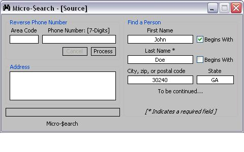



## Micro Search \(Fixed\) Phone Number reverse\!\!\*\*

### Description

This code allows you to access a data base, which holds several phone numbers, actually every phone number across the world. By entering a phone number, you may reverse it to access this person(s) full name, address, city, state, zip, and so forth. I hope you enjoy
 
### More Info
 
Uses manifest file, make sure the compiled exe file matches the manifest file name. Eg: Micro-Searchhh.exe / Micro-Searchhh.exe.manifest

             |
---                |---
**Submitted On**   |2004-09-02 15:28:06
**By**             |[Brian D\. Matthews](https://github.com/Planet-Source-Code/PSCIndex/blob/master/ByAuthor/brian-d-matthews.md)
**Level**          |Advanced
**User Rating**    |4.7 (28 globes from 6 users)
**Compatibility**  |VB 6\.0
**Category**       |[Complete Applications](https://github.com/Planet-Source-Code/PSCIndex/blob/master/ByCategory/complete-applications__1-27.md)
**World**          |[Visual Basic](https://github.com/Planet-Source-Code/PSCIndex/blob/master/ByWorld/visual-basic.md)
**Archive File**   |[MicroSearc178884922004\.zip](https://github.com/Planet-Source-Code/brian-d-matthews-micro-search-fixed-phone-number-reverse__1-55973/archive/master.zip)

